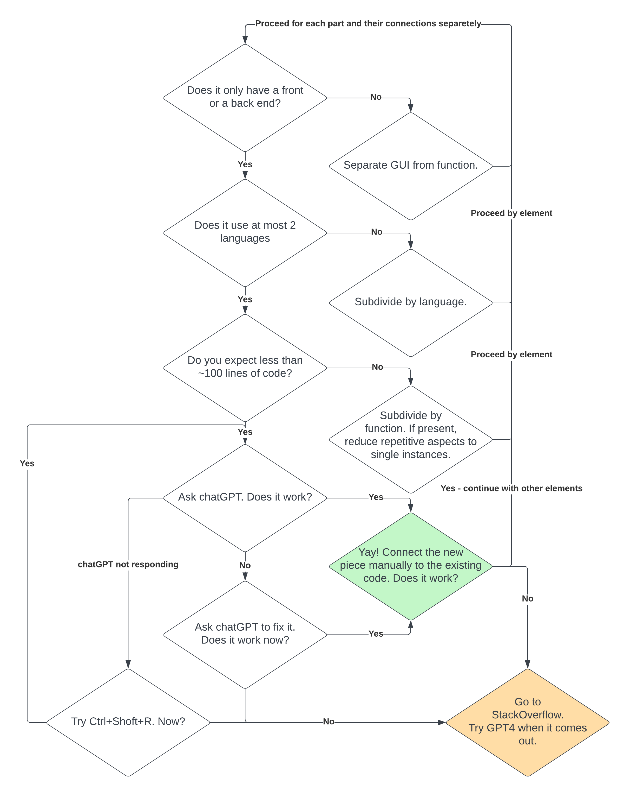

# How2chatGPT
How to learn coding an improve your coding experience! 

The code in this repo was completely created by chatGPT with me only using copy and paste and changing text elements. 
Run it via 
uvicorn flowchart:app --host localhost --port 8000 --reload

Or just follow the flowchart.

